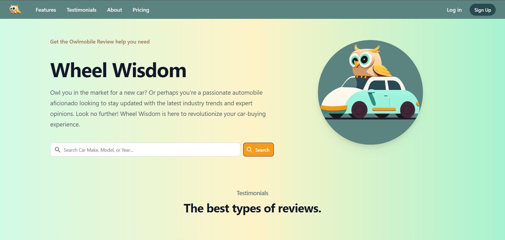
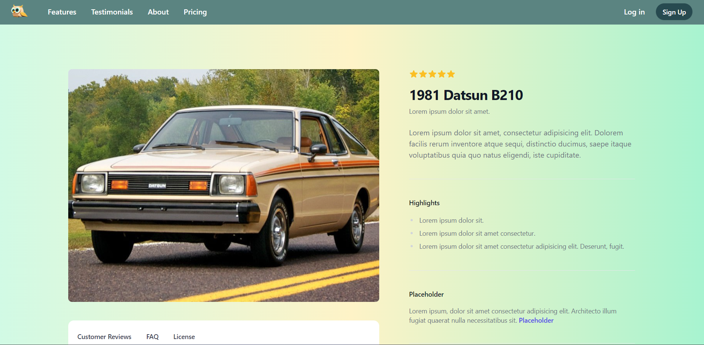

# Wheel Wisdom

## Table of Contents:

- [Description](#description)
- [User Story](#UserStory)
- [Usage](#usage)
- [Technologies](#technologies)
- [Future Development](#futureDevelopment)
- [Credits](#credits)
- [License](#license)

## Description:

Welcome to Wheel Wisdom, a full-stack website where car enthusiasts can sign-up, explore, and leave reviews on their favorite cars! This platform is designed to provide resource for sharing experiences, insights, and opinions on various automobiles.

[Wheel Wisdom Website](https://shrouded-taiga-83609-cc45cc6f9d2e.herokuapp.com)

[Wheel Wisdom GitHub](https://github.com/Ienxternal/wheelwisdom)

## User Story:

As a car enthusiast, I want to stay updated on industry trends, explore car listings, and share insights with a vibrant community of car enthusiasts. 

I browse through a vast collection of cars, reading detailed reviews for real-world insights on performance, reliability, and features.

By contributing my own experiences and engaging in discussions, I unlock the wisdom of wheels and make informed car-buying decisions. 

Wheel Wisdom transforms the car-buying experience, providing a comprehensive platform for passionate enthusiasts like me.

## Technologies Used: 

WheelWisdom was built with the following technologies:

- HTML5
- CSS3
- TailWind
- Handlebars.js
- Node.js
- JSON
- Bcrypt
- Sequelize
- Node.js
- Express.js
- MySQL

## Future Development: 

- Ability to rate vehicles with stars (or owls)
- Verified reviews
- Community forums
- Meetups
- Different pages for motorcycles, RVs, classic cars, etc.
- Links to dealerships, car insurance…
- Market value
- Up vote/down vote

## Credits:

Wheel Wisdom was built by:

- [Alex Nguyen](https://github.com/Ienxternal)
- [Benjamin Vega](https://github.com/Ben-vegabond)
- [Robert Ruffin](https://github.com/Crow-III)
- [Richard Aspinall](https://github.com/rikilega)
- [Julius Wong](https://github.com/userdefault13)
- [Lauren Smith](https://github.com/LauSmi)

## License:

Wheel Wisdom is licenced under the MIT license.

